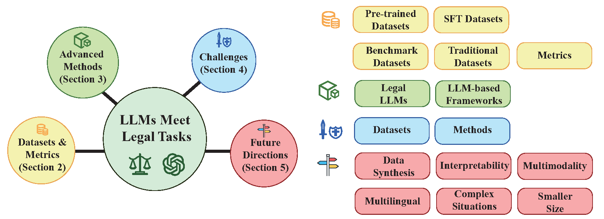
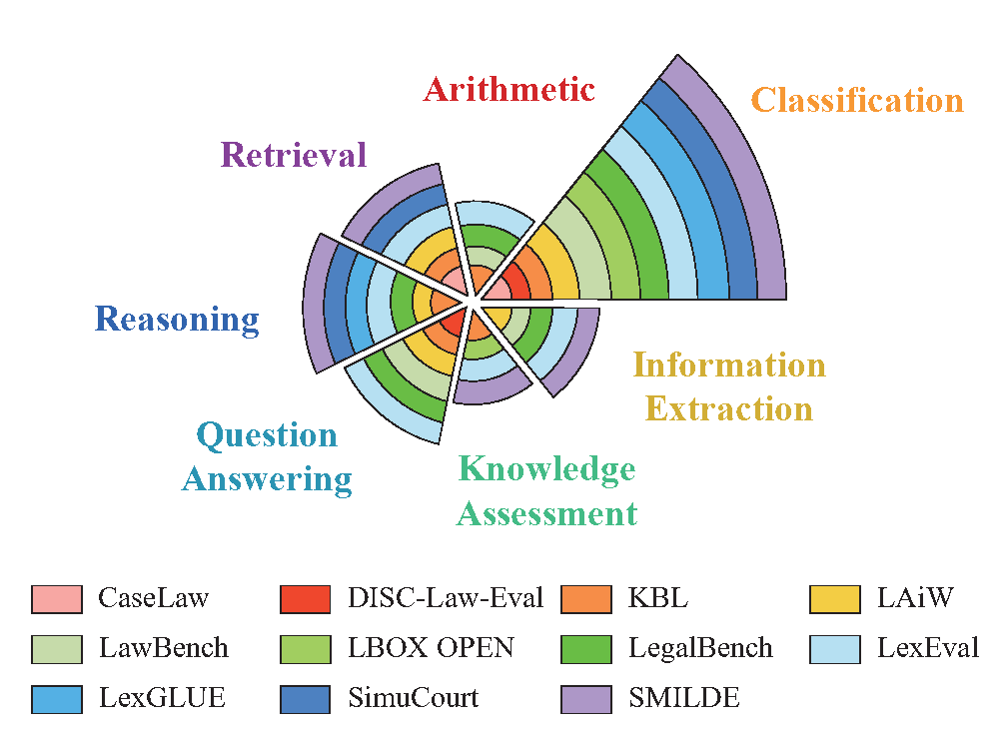
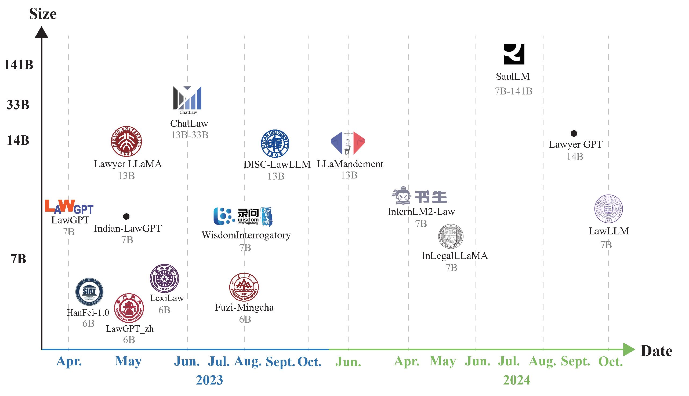
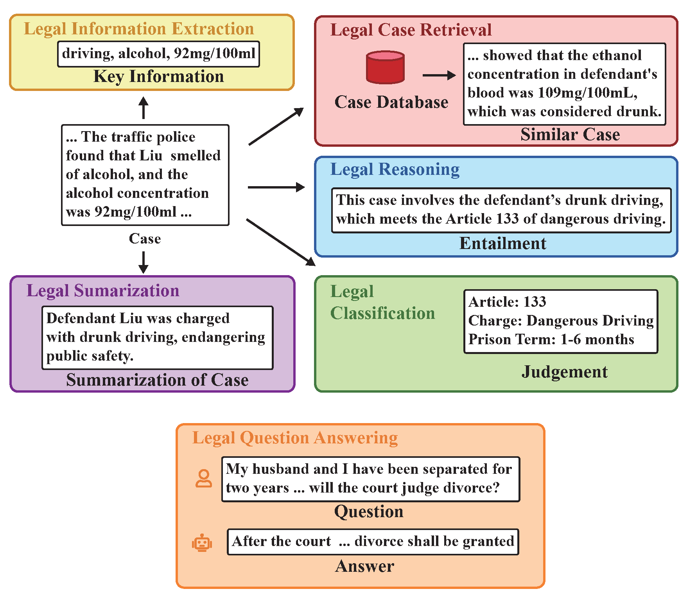

# ⚖️ LLMs4LegalAI
This is a repository of [Large Language Models Meet Legal Artificial Intelligence: A Survey](https://arxiv.org/abs/2509.09969). The content covered in this survey is up to date as of January 2025.
## 📚 Overview
Here is the overview of our survey.
<p align="center">

</p>

## 📂 Datasets
We have collected a range of datasets and analysed the capabilities they covered. And we provide a list of our collected datasets below:

<p align="center">

</p>

1. CaseLaw [website](https://case.law/)
2. Position-aware Attention and Supervised Data Improve Slot Filling [paper](https://aclanthology.org/D17-1004/)
3. CAIL2018: A Large-Scale Legal Dataset for Judgment Prediction [paper](https://arxiv.org/abs/1807.02478)
4. CrimeKgAssitant [github](https://github.com/liuhuanyong/CrimeKgAssitant)
5. JEC-QA: A Legal-Domain Question Answering Dataset [paper](https://ojs.aaai.org/index.php/AAAI/article/view/6519)
6. Neural Legal Judgment Prediction in English [paper](https://aclanthology.org/P19-1424/)
7. When does pretraining help?: assessing self-supervised learning for law and the CaseHOLD dataset of 53,000+ legal holdings [paper](https://dl.acm.org/doi/10.1145/3462757.3466088)
8. Swiss-Judgment-Prediction: A Multilingual Legal Judgment Prediction Benchmark [paper](https://aclanthology.org/2021.nllp-1.3/)
9. Joint Entity and Relation Extraction for Legal Documents with Legal Feature Enhancement [paper](https://aclanthology.org/2020.coling-main.137/)
10. Knowledge Graph Based Synthetic Corpus Generation for Knowledge-Enhanced Language Model Pre-training [paper](https://aclanthology.org/2021.naacl-main.278/)
11. Re-TACRED: Addressing Shortcomings of the TACRED Dataset [paper](https://ojs.aaai.org/index.php/AAAI/article/view/17631)
12. LexGLUE: A Benchmark Dataset for Legal Language Understanding in English [paper](https://aclanthology.org/2022.acl-long.297/)
13. LEVEN: A Large-Scale Chinese Legal Event Detection Dataset [paper](https://aclanthology.org/2022.findings-acl.17/)
14. DISC-Law-Eval, DISC-LawLLM: Fine-tuning Large Language Models for Intelligent Legal Services [paper](https://arxiv.org/abs/2309.11325)
15. LEEC: A Legal Element Extraction Dataset with an Extensive Domain-Specific Label System [paper](https://arxiv.org/abs/2310.01271)
16. LawBench: Benchmarking Legal Knowledge of Large Language Models [paper](https://aclanthology.org/2024.emnlp-main.452/)
17. Multi-Defendant Legal Judgment Prediction via Hierarchical Reasoning [paper](https://aclanthology.org/2023.findings-emnlp.145/)
18. LegalBench: A Collaboratively Built Benchmark for Measuring Legal Reasoning in Large Language Models [paper](https://proceedings.neurips.cc/paper_files/paper/2023/hash/89e44582fd28ddfea1ea4dcb0ebbf4b0-Abstract-Datasets_and_Benchmarks.html)
19. H-LegalKI: A Hierarchical Legal Knowledge Integration Framework for Legal Community Question Answering [paper](https://aclanthology.org/2024.findings-emnlp.856/)
20. LBOX OPEN, A Multi-Task Benchmark for Korean Legal Language Understanding and Judgement Prediction [paper](https://papers.neurips.cc/paper_files/paper/2022/file/d15abd14d5894eebd185b756541d420e-Paper-Datasets_and_Benchmarks.pdf)
21. LAiW: A Chinese Legal Large Language Models Benchmark [paper](https://aclanthology.org/2025.coling-main.716/)
22. SimuCourt, AgentsCourt: Building Judicial Decision-Making Agents with Court Debate Simulation and Legal Knowledge Augmentation [paper](https://aclanthology.org/2024.findings-emnlp.549/)
23. CLERC: A Dataset for Legal Case Retrieval and Retrieval-Augmented Analysis Generation [paper](http://arxiv.org/abs/2406.17186)
24. SMILED, One Law, Many Languages: Benchmarking Multilingual Legal Reasoning for Judicial Support [paper](http://arxiv.org/abs/2306.09237)
25. LexSumm and LexT5: Benchmarking and Modeling Legal Summarization Tasks in English [paper](https://aclanthology.org/2024.nllp-1.35/)
26. LeDQA: A Chinese Legal Case Document-based Question Answering Dataset [paper](https://dl.acm.org/doi/10.1145/3627673.3679154)
27. LexEval: A Comprehensive Chinese Legal Benchmark for Evaluating Large Language Models [paper](https://proceedings.neurips.cc/paper_files/paper/2024/file/2cb40fc022ca7bdc1a9a78b793661284-Paper-Datasets_and_Benchmarks_Track.pdf)
28. NYAYAANUMANA and INLEGALLLAMA: The Largest Indian Legal Judgment Prediction Dataset and Specialized Language Model for Enhanced Decision Analysis [paper](https://aclanthology.org/2025.coling-main.738/)
29. CaseSumm: A Large-Scale Dataset for Long-Context Summarization from U.S. Supreme Court Opinions [paper](http://arxiv.org/abs/2501.00097)
30. CAIL Competition [website](http://cail.cipsc.org.cn/index.html)
31. LAIC Competition [website](https://laic.cjbdi.com/)
32. KBL, Developing a Pragmatic Benchmark for Assessing Korean Legal Language Understanding in Large Language Models [paper](https://aclanthology.org/2024.findings-emnlp.319/)
## Methods
### 🤖 Legal LLMs
We also investigated 16 series of Legal LLMs in different languages, listing the papers and visualizing their release dates and sizes in figure below:

<p align="center">
  
</p>


1. LawGPT_zh [github](https://github.com/LiuHC0428/LAW-GPT)
2. DISC-LawLLM: Fine-tuning Large Language Models for Intelligent Legal Services [paper](https://arxiv.org/abs/2309.11325)
3. Lawyer LLaMA Technical Report [paper](http://arxiv.org/abs/2305.15062)
4. LLaMandement: Large Language Models for Summarization of French Legislative Proposals [paper](http://arxiv.org/abs/2401.16182)
5. SaulLM-7B: A pioneering Large Language Model for Law [paper](http://arxiv.org/abs/2403.03883)
6. Chatlaw: A Multi-Agent Collaborative Legal Assistant with Knowledge Graph Enhanced Mixture-of-Experts Large Language Model [paper](http://arxiv.org/abs/2306.16092)
7. LawGPT: A Chinese Legal Knowledge-Enhanced Large Language Model [paper](http://arxiv.org/abs/2406.04614)
8. InternLM-Law: An Open Source Chinese Legal Large Language Model [paper](https://aclanthology.org/2025.coling-main.629/)
9. SaulLM-54B & SaulLM-141B: Scaling Up Domain Adaptation for the Legal Domain [paper](http://arxiv.org/abs/2407.19584)
10. Lawyer GPT: A Legal Large Language Model with Enhanced Domain Knowledge and Reasoning Capabilities [paper](https://dl.acm.org/doi/10.1145/3689299.3689319)
11. InLegalLLaMA: Indian Legal Knowledge Enhanced Large Language Model [paper](https://www.semanticscholar.org/paper/InLegalLLaMA%3A-Indian-Legal-Knowledge-Enhanced-Large-Ghosh-Verma/baf44e4b87448fefc0df283e4faeda58f606ec90)
12. LawLLM: Law Large Language Model for the US Legal System [paper](https://dl.acm.org/doi/10.1145/3627673.3680020)
13. Fuzi-Mingcha [github](https://github.com/irlab-sdu/fuzi.mingcha)
14. Hanfei-1.0 [github](https://github.com/siat-nlp/HanFei)
15. WisdomInterrogatory [github](https://github.com/zhihaiLLM/wisdomInterrogatory)
16. Indian-LawGPT: A Large Language Model Based on Indian Legal Knowledge [github](https://github.com/jfontestad/Indian-LegalGPT)
17. LexiLaw [github](https://github.com/CSHaitao/LexiLaw)
### 🧰 LLM-based Frameworks
There are also several LLM-based frameworks in legal domain. We classify them based on different main legal tasks and list the papers:
<p align="center">
  
</p>

1. A Framework for Enhancing Statute Law Retrieval Using Large Language Models [paper](https://dl.acm.org/doi/10.1007/978-981-97-3076-6_17)
2. Employing Label Models on ChatGPT Answers Improves Legal Text Entailment Performance [paper](https://arxiv.org/abs/2401.17897)
3. Boosting legal case retrieval by query content selection with large language models [paper](https://dl.acm.org/doi/10.1145/3624918.3625328)
4. Learning Interpretable Legal Case Retrieval via Knowledge-Guided Case Reformulation [paper](https://aclanthology.org/2024.emnlp-main.73/)
5. Leveraging Large Language Models for Relevance Judgments in Legal Case Retrieval [paper](https://arxiv.org/abs/2403.18405)
6. Myanmar Law Cases and Proceedings Retrieval with GraphRAG [paper](https://ieeexplore.ieee.org/document/10825155)
7. Automatic Information Extraction From Employment Tribunal Judgements Using Large Language Models [paper](https://arxiv.org/abs/2403.12936)
8. A case study for automated attribute extraction from legal documents using large language models [paper](https://link.springer.com/article/10.1007/s10506-024-09425-7)
9. Deep Legal Element Extraction Via Hierarchical Re-Answer Reasoning Through Large Language Models [paper](https://papers.ssrn.com/sol3/papers.cfm?abstract_id=5055580)
10. From Text to Structure: Using Large Language Models to Support the Development of Legal Expert Systems [paper](https://arxiv.org/abs/2311.04911)
11. Large Language Models for Judicial Entity Extraction: A Comparative Study [paper](https://arxiv.org/abs/2407.05786)
12. Optimizing Numerical Estimation and Operational Efficiency in the Legal Domain through Large Language Models [paper](https://dl.acm.org/doi/10.1145/3627673.3680025)
13. Athena: Retrieval-augmented Legal Judgment Prediction with Large Language Models [paper](https://arxiv.org/abs/2410.11195)
14. Precedent-Enhanced Legal Judgment Prediction with LLM and Domain-Model Collaboration [paper](https://aclanthology.org/2023.emnlp-main.740/)
15. Legal Syllogism Prompting: Teaching Large Language Models for Legal Judgment Prediction [paper](https://dl.acm.org/doi/10.1145/3594536.3595170)
16. Enabling Discriminative Reasoning in LLMs for Legal Judgment Prediction [paper](https://aclanthology.org/2024.findings-emnlp.43/)
17. LegalReasoner: A Multi-Stage Framework for Legal Judgment Prediction via Large Language Models and Knowledge Integration [paper](https://ieeexplore.ieee.org/document/10750819)
18. AgentsCourt: Building Judicial Decision-Making Agents with Court Debate Simulation and Legal Knowledge Augmentation [paper](https://aclanthology.org/2024.findings-emnlp.549/)
19. CBR-RAG: Case-Based Reasoning for Retrieval Augmented Generation in LLMs for Legal Question Answering [paper](https://link.springer.com/chapter/10.1007/978-3-031-63646-2_29)
20. Interpretable Long-Form Legal Question Answering with Retrieval-Augmented Large Language Models [paper](https://ojs.aaai.org/index.php/AAAI/article/view/30232)
21. BLADE: Enhancing Black-box Large Language Models with Small Domain-Specific Models [paper](https://arxiv.org/abs/2403.18365)
22. H-LegalKI: A Hierarchical Legal Knowledge Integration Framework for Legal Community Question Answering [paper](https://aclanthology.org/2024.findings-emnlp.856/)
23. A Study on Unsupervised Question and Answer Generation for Legal Information Retrieval and Precedents Understanding [paper](https://dl.acm.org/doi/10.1145/3626772.3661354)
24. Reformulating Domain Adaptation of Large Language Models as Adapt-Retrieve-Revise: A Case Study on Chinese Legal Domain [paper](https://aclanthology.org/2024.findings-acl.299/)
25. Chain-of-Thought Prompting Elicits Reasoning in Large Language Models [paper](https://proceedings.neurips.cc/paper_files/paper/2022/file/9d5609613524ecf4f15af0f7b31abca4-Paper-Conference.pdf)
26. Can GPT-3 Perform Statutory Reasoning? [paper](https://dl.acm.org/doi/10.1145/3594536.3595163)
27. Legal Prompting: Teaching a Language Model to Think Like a Lawyer [paper](https://arxiv.org/abs/2212.01326)
28. Black-Box Analysis: GPTs Across Time in Legal Textual Entailment Task [paper](https://arxiv.org/abs/2309.05501)
29. Can Large Language Models Grasp Legal Theories? Enhance Legal Reasoning with Insights from Multi-Agent Collaboration [paper](https://aclanthology.org/2024.findings-emnlp.445/)
30. CaseGPT: a case reasoning framework based on language models and retrieval-augmented generation [paper](https://arxiv.org/abs/2407.07913)
31. Dallma: Semi-Structured Legal Reasoning and Drafting with Large Language Models [paper](https://icml.cc/virtual/2024/39198)
32. Employing Label Models on ChatGPT Answers Improves Legal Text Entailment Performance [paper](https://arxiv.org/abs/2401.17897)
33. How Ready are Pre-trained Abstractive Models and LLMs for Legal Case Judgement Summarization? [paper](https://arxiv.org/abs/2306.01248)
34. Legal Summarisation through LLMs: The PRODIGIT Project [paper](https://arxiv.org/abs/2308.04416)
35. Leveraging Long-Context Large Language Models for Multi-Document Understanding and Summarization in Enterprise Applications [paper](https://arxiv.org/abs/2409.18454)
36. Adapting abstractive summarization to court examinations in a zero-shot setting: A short technical paper [paper](https://ceur-ws.org/Vol-3435/short3.pdf)
37. LaMSUM: Amplifying Voices Against Harassment through LLM Guided Extractive Summarization of User Incident Reports [paper](https://arxiv.org/abs/2406.15809)
38. Lessons Learned on Summarizing Legal Documents Combining Reinforcement Learning and ChatGPT [paper](https://link.springer.com/chapter/10.1007/978-3-031-64779-6_40)
39. Low-resource court judgment summarization for common law systems [paper](https://dl.acm.org/doi/10.1016/j.ipm.2024.103796)
40. PolicyGPT: Automated Analysis of Privacy Policies with Large Language Models [paper](https://arxiv.org/abs/2309.10238)
41. GoldCoin: Grounding Large Language Models in Privacy Laws via Contextual Integrity Theory [paper](https://aclanthology.org/2024.emnlp-main.195/)
42. LLMediator: GPT-4 Assisted Online Dispute Resolution [paper](https://arxiv.org/abs/2307.16732)
43. Automating Legal Concept Interpretation with LLMs: Retrieval, Generation, and Evaluation [paper](https://arxiv.org/abs/2501.01743)
44. Adchat-TVQA: Innovative Application of LLMs-Based Text-Visual Question Answering Method in Advertising Legal Compliance Review [paper](https://ieeexplore.ieee.org/document/10754395)
45. Garbage in, garbage out: Zero-shot detection of crime using Large Language Models [paper](https://arxiv.org/abs/2307.06844)
46. Legal Information Retrieval and Entailment Using Transformer-based Approaches [paper](https://link.springer.com/article/10.1007/s12626-023-00153-z)
47. Explicitly Integrating Judgment Prediction with Legal Document Retrieval: A Law-Guided Generative Approach [paper](https://dl.acm.org/doi/10.1145/3626772.3657717)


## 📖 Citation
If you find this project helpful, please consider citing our paper:
```bibtet
@misc{hou2025largelanguagemodelsmeet,
      title={Large Language Models Meet Legal Artificial Intelligence: A Survey}, 
      author={Zhitian Hou and Zihan Ye and Nanli Zeng and Tianyong Hao and Kun Zeng},
      year={2025},
      eprint={2509.09969},
      archivePrefix={arXiv},
      primaryClass={cs.CL},
      url={https://arxiv.org/abs/2509.09969}, 
}
```